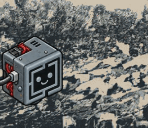
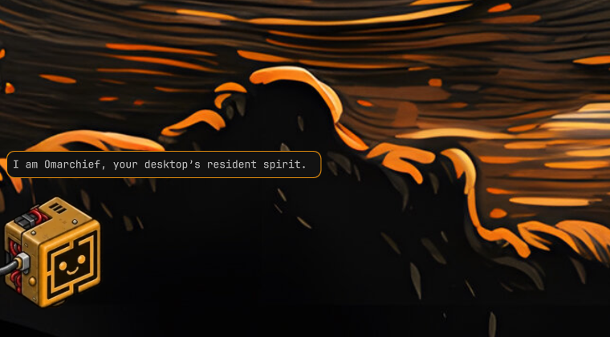
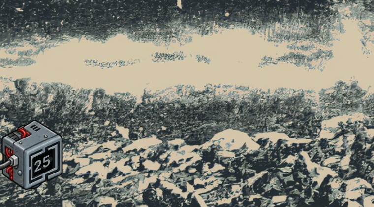
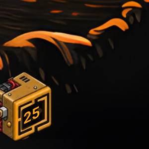
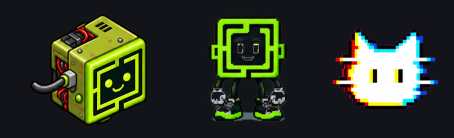

# Omarchief

Your desktop's chief of staff.



A small creature lives in the corner of your desktop. Click it, type what
you want — *switch to tokyo-night*, *why is my wifi down*, *open Spotify on
my right screen* — and it goes and does it, then tells you what it did.





It answers in its own voice, not in a terminal: your default agent runs
behind it, and the reply lands in a speech bubble above its head. The
Quake console stays one right-click away for work that deserves a full
session, and it opens carrying the same conversation.

Between orders it stays where you put it and finds things to do. It reads
your agent too — digging while it works, holding up a balloon when it needs
you, asleep when your rate limits are spent.

That's the whole idea. Omarchy ships the agent and the console; Omarchief
gives them a body, a voice, and a place to stand.

## Install

```bash
omarchy plugin add https://github.com/daventhedude/omarchief.git --enable --yes
```

No setup. It uses the agent you picked with `omarchy default agent`, and
offers the picker if you never picked one.

### Where it lives, and what it does there

The creature stands in the bottom-left corner, far enough out that the
cable it trails runs off the screen, and its feet land on the same line
a window's edge does — it reads Hyprland's own `gaps_out` rather than
inventing a margin. Drag it anywhere along the edge and that becomes its
place, remembered per monitor, so a spot chosen on a wide screen does not
follow it onto a narrow one.

Its face follows the agent. Gritty, the pet it ships with, thinks while
the agent works, stares at you when the agent needs an answer, sparkles
when a run finishes, bares its teeth at an error, looks downcast as the
rate limits run low, and falls asleep when they are gone.

Between all that it is not frozen. Every so often a resting creature
looks up wearing something else for a few seconds — pleased, delighted,
fond of you, or with its tongue out — and then goes back to resting. And
it blinks, every few seconds, sometimes twice: the cheapest sign that
anything here is alive, and the one thing that never stops. Never while anything is
actually happening, and rarely enough that catching it feels like
catching something. The switch for it is in the bar popout.

A pet does not have to move to be alive: gritty never walks and has no
performances, and the only thing that ever shifts it across a screen is
your hand. A pet drawn the other way — walk cycles, idle animations — is
just as welcome, and [docs/pets.md](docs/pets.md) covers both.

## Putting it in the bar

Omarchief ships two things in one plugin: the creature (a panel) and a
bar widget to steer it. Installing enables the creature; the widget is
one line in `~/.config/omarchy/shell.json`, because `omarchy bar put`
files a two-kind plugin under `plugins[]` rather than into the bar:

```jsonc
// bar → layout → right
{ "id": "io.github.daventhedude.omarchief" }
```

It hot-reloads on save.

### Removal

```bash
omarchy-shell omarchief hooks off        # if you ever turned them on
omarchy plugin remove io.github.daventhedude.omarchief
rm -rf ~/.local/state/omarchy/omarchief  # status, timer, sessions, themed sheets
rm -f ~/.config/omarchy/omarchief.json   # your settings, if you made any
```

Then drop the widget line above from `~/.config/omarchy/shell.json` if
you added it. That is the whole footprint: Omarchief writes nowhere else.

Forgetting the first line is survivable. The hooks it installs into
`~/.claude/settings.json` are written guarded — `test -x … || true` — so
once the plugin is gone they do nothing at all rather than failing on
every event. `omarchy-shell omarchief hooks off` still takes the lines
out, and it only ever touches its own.

### What it needs

Nothing beyond Omarchy itself to stand there and be clicked.

| For | It uses | If missing |
|---|---|---|
| Orders and the console | the agent you point it at — `claude`, `codex` or `opencode` | it says so, and the click opens the console instead |
| Wearing your theme | `magick` (ImageMagick), which Omarchy already installs | it wears the colours it was drawn in |
| Saying the timer ran out | `notify-send`, which Omarchy already installs | the speech bubble still says it |
| Knowing what your agent is doing | five hooks in `~/.claude/settings.json`, opt-in from the bar | its face follows the rate limit instead |

The tools under `tools/` are for building pets and checking the plugin,
not for running it: those want `python3`, `grim` and `node`.

It makes no network calls of its own — none, ever. The agent you point it
at makes its own, as it does from your terminal.

## Give orders

| You | Omarchief |
|---|---|
| Click the chief | A one-line order form opens above it |
| Type and press Enter | It thinks in dots, acts, and answers in its speech bubble |
| Ask a follow-up | Same conversation — the session carries over |
| Enter on an empty line | Summons the Quake console |
| Right-click | The console, on the chief's monitor, resuming the bubble's conversation |
| Click the bubble | Puts the reply away (the conversation lives on) |
| Esc, or click anywhere else | Puts the form away (your draft survives) |
| Middle-click | Dismisses the chief for this session (`omarchy-shell omarchief show` brings it back) |
| Push it down | Tucks it away: it sinks into the edge it stands on, leaving the top of its head up. It gives way as you push, so you can see it happening, and springs back if you let go early. Hover the peek and it lifts a little |
| Click it while it is away | Puts it to work without bringing it back: the order form opens over whatever is showing, and the answer arrives there. Out of the way is not off duty |
| Drag it out | The way to have it back: take hold of the peek and pull. The bar's **Bring it back** does the same |
| Push it against a side | Puts it away there with a peek of itself showing. Its place on the edge does not change — only the picture moves — so letting it out stands it exactly where it was |

Spoken orders run your default agent headless with the same trust as
Omarchy's own agent keybinding; it may use `omarchy` and `hyprctl` to do
what you asked before it answers — and it may even send its own body to
the monitor its work concerns. It is one conversation until you end it,
which the bar does in a click; set `sessionIdleMin` and it starts fresh
after that many quiet minutes instead.

| Default agent | Speech bubble | Console escalation |
|---|---|---|
| claude | native, streamed | resumes the same session |
| opencode | native, streamed | fresh console session |
| codex | native, streamed | resumes the same session |
| everything else | — (order opens the console) | via `omarchy agent prompt` |

On Omarchy 4.1 the console is upstream's Quake console; on 4.0 Omarchief
seeds the scratchpad the same way 4.1 would.

## One world, many screens

The chief knows your monitor layout in virtual coordinates and treats it
as one world rather than three separate edges. It crosses between screens
by diving under the bottom edge, travelling out of sight, and rising where
it is going; the time it takes scales with the real distance.

`omarchy-shell omarchief travel DP-2` sends it somewhere, and the console
always drops where it stands. It remembers which screen it lives on, so
it comes back there rather than to wherever the focus happened to be. A
pet that walks also follows your focus; a still one stays put, since
crossing a screen boundary is not something you can drag it across.

## It lives your agent's life

- **Energy is your rate limits.** Omarchief reads the same usage records as
  the first-party Agents widget. Below 30% remaining it drags its feet; at
  zero it falls asleep until the window resets.
- **With agent hooks** (the OmaPets-compatible status file), it knows
  precisely what your agent is doing: thinking while the agent works, wide
  eyes and a "!" when the agent needs your permission, sparkles for a
  finished run, a scowl on an error. Click it and the console drops exactly
  where you're needed.
- **Without hooks** it still knows the essentials: agent sessions parked in
  a closed console get a thought bubble; an open console means work.
- **It wears your theme.** Gritty is redrawn in your theme's accent the
  moment you switch — hue from the theme, vividness from the artist, and
  lightness fitted until it clears the contrast WCAG asks of a graphic
  against the desktop behind it. Ask for `"pet": ""` and you get a body
  drawn from theme colours alone, no assets at all.
- A pet that can walk follows your focused monitor (debounced, so it
  doesn't teleport). Either kind hides while anything runs fullscreen.

## A screen to put things on



The panel on the creature's front is a screen, and a screen that only ever
shows a face is being wasted. Ask for a timer and it holds it there:

```bash
omarchy-shell omarchief timer 25m     # or 90s, or 1h30m, or a bare 10 for minutes
omarchy-shell omarchief timer off
```

Whole minutes while there is more than one, seconds under it — two big
digits read across a room and `24:59` does not. It glows in whatever the
creature is wearing, it is sheared to sit on the panel rather than float
in front of it, and it survives a shell reload, because a timer you
cannot trust is not a timer. When it runs out the creature hops, says so
in its bubble, and sends a desktop notification — a bubble on a screen
you are not looking at is a timer that did not go off.

The bar has the usual lengths as a row, and shows what is left on the
button itself. If you would rather have the time of day there, the bar
offers that too; its face is the default, because a screen showing the
clock forever is a screen never showing an expression.

Any pet can have one: say where the panel is in `pet.json` and what slope
its top edge is drawn at, and the digits land on it. See
[docs/pets.md](docs/pets.md).

## The bar widget


The chief's face with a mood dot, and a popout with everything you'd
shout across the room — ask, console, send it to a monitor, hide it,
pick the agent, and what it said last for whoever missed the bubble.

Below that, the settings worth having to hand, as real switches rather
than another row of text. Each one only appears when it has something to
offer — one screen means no screen picker, one agent means no agent
picker, a pet with no faces means no expression switch:

- **Timer** — five, fifteen, twenty-five minutes, or off, with what is
  left of it written into the heading.
- **Where and who** — which screen it stands on, which of your installed
  pets stands there, and which agent answers.
- **Answer in a bubble** — off sends every order to the console instead.
- **See the console agent** — the five hooks, installed and removed from
  here.
- **Step aside for fullscreen** — get out of the way while something is.
- **One conversation lasts** — until you end it, an hour, or each order.
- **Wear your theme** — repainted in your theme's colours, or keeping the
  ones it was drawn in. Only offered for a pet that could be repainted.
- **Its screen shows** — its face, a timer while one runs, or the clock.
- **The console opens** — dropping from the top, or over the creature.
- **Follow my focus** — for a pet that can walk: over to the screen you are
  working on, or staying where you left it.
- **Idle expressions**, and **how often** — never, rarely, now and then,
  often.
- **Size** — cycles through the sizes a creature on an edge looks right at.

See [putting it in the bar](#putting-it-in-the-bar) above for the one
line that places it, or `omarchy-shell omarchief.menu toggle` from a
keybinding. Everything else still lives in the config file below; the
bar has the things you change more than once.

It feeds off the same published status file any script of yours can
read — [what `status` says](#what-status-says), below. Anything else on
your machine is welcome to watch it too.

## Bring your own body



Omarchief renders any pet in the Codex/Petdex spritesheet format
([petdex.dev](https://petdex.dev), [codex-pets.net](https://codex-pets.net),
[openpets.dev](https://openpets.dev)). Drop a pet folder (its `pet.json`
plus spritesheet) into `~/.config/omarchief/pets/<id>/` — pets installed
for OmaPets under `~/.config/omapets/pets/` are found too — and set:

```json
{ "pet": "glitchcat" }
```

The atlas's directional walk rows are used for actual walking, which bar
pets never get to do.

A pet does not have to be an atlas at all. `columns` lets a sheet be any
grid rather than the ecosystem's eight-wide strip, and `faces` maps a
mood straight to a cell — one drawing per feeling, no animation, nothing
moving of its own accord. That is what gritty is, and
[docs/pets.md](docs/pets.md) has the whole format.

Two honest `pet.json` extensions round out the animated kind:

```json
{ "themeTint": true, "sleepRow": 3 }
```

`themeTint` is the live fallback: a colorization applied as the sprite is
drawn, lifted until it clears 4.5:1 against the theme's background. It
needs nothing installed and works on any pet, but it trades the artwork's
own colours for one hue — so it is what you get when a proper redraw is
impossible, and `themeable` below is what you want. `sleepRow` points the sleeping mood at an atlas row with a real
sleeping pose instead of the dimmed freeze-frame. `walkFrames` says how
long the gait actually is, so a cycle shorter than the atlas's eight
columns stops stuttering through empty cells.

## Wearing your theme

A pet can go further than a tint and be genuinely redrawn for the theme:

```json
{ "themeable": { "hueMin": 40, "hueMax": 100, "satMin": 15 } }
```

That window names the hues that count as the pet's skin. When your theme
changes, the hue inside the window is replaced with the theme's accent,
and every pixel outside it stays exactly as drawn: Gritty's cables,
servos and boots survive every theme, only its shell changes colour.

What the theme lends is that hue, and not much else. Scaling the
artwork's vividness by the accent's own is the obvious reading of "wear
the theme" and it is wrong — most themes accent with a muted mid-tone,
and a pet repainted that way turns grey, in the same washed hue as the
desktop it stands on. Vividness survives whole for any accent with colour
in it, and is given up only as the accent approaches grey, where a vivid
pet would misrepresent the theme and the hue has no meaning left anyway.

Contrast does not take care of itself, which an audit of all twenty-two
shipped themes made plain: on five of them the creature sat below the 3:1
WCAG asks of a graphic, and on far more it was a dim smudge. Lightness is
therefore fitted — as a gamma, so nothing clips, black stays black and
the shading keeps its order — until the pet's body clears that floor
against the desktop behind it. Lifted on a dark theme, deepened on a pale
one. Where the theme's accent is a brighter shade of its own wallpaper,
so that hue separates nothing and lightness is doing all the work alone,
the floor is 4.5:1 instead. Worst case across the twenty-two is 3.1:1,
and no theme lost its look.

If ImageMagick is missing the redraw cannot run, and a pet that asked for
`themeable` falls back to the live tint rather than to nothing.

Every theme on the machine is dressed in advance, in the background, at the
lowest priority the scheduler offers and only while nothing is being asked
of the creature — twenty-two themes take about eleven seconds and three
megabytes, once. After that, changing theme is a comparison and a
crossfade, with no redraw at all: Omarchy glides the wallpaper across four
tenths of a second and the creature changes with it rather than a second
behind it.

A theme it meets for the first time is drawn on the spot, in about three
quarters of a second. Sheets are kept in `~/.local/state/omarchy/omarchief/themed/`,
one sheet per accent and desktop, each beside a stamp naming what it was
drawn for and from. Wearing a theme the creature has worn before is a
comparison and no redraw at all. Delete that folder any time; it rebuilds
itself. It needs ImageMagick, which Omarchy already installs, and the
same tool runs by hand:

```bash
tools/omarchief-recolor pets/gritty/gritty-faces.webp /tmp/blue.webp \
  "#7aa2f7" 40 175 12 "#1a1b26"
#             accent  hue window  skin   the desktop it must be read against
```

Leave the last argument off and it recolours without fitting the
lightness, which is what the pet looks like before contrast is
considered. `OMARCHIEF_CONTRAST_FLOOR` overrides the floor it aims for.

**Drawing a themeable pet:** keep the surfaces you want recolored inside
one hue family and paint them with the full range from shadow to
highlight — the recolor swaps hue, your lightness does the modelling.
Anything that should stay itself (cables, metal, eyes) simply lives
outside that hue window. [docs/pets.md](docs/pets.md) is the full format
reference, and `tools/build-atlas.py` assembles a sheet from renders.

## Making your own pet

The creature is artwork plus a small description; anything drawn to the
same rules can take its place. [docs/pets.md](docs/pets.md) covers the
sheet layout, every `pet.json` field, and the three drawing rules that
decide whether a rendered sheet walks or limps.
`tools/build-atlas.py` assembles one from renders — measuring the frame
timing, the playback order and the scale rather than asking you to.

## Configure

Settings live where the shell keeps every plugin's: **inline on this
plugin's own entry in `~/.config/omarchy/shell.json`**, which is the
shell's own rule — no separate per-plugin settings file. Change one from
the bar and it is written there; hot-reloaded either way.

```json
{ "id": "io.github.daventhedude.omarchief", "pet": "gritty", "size": 96,
  "theme": true, "readout": "timer" }
```

Being an entry is also how the shell decides a third-party plugin is
enabled at all, so disabling or removing the plugin takes the entry with
it, and the settings on it. That is the shell's model rather than
something this plugin could hold onto; if you are going to turn it off and
back on, keep a copy of the entry. Re-enabling puts the component back but
does not restore the row it was on.

`~/.config/omarchy/omarchief.json` is still read, so nothing is lost on an
update from an earlier version; the entry wins wherever both speak, and
the first setting you change moves everything across. Every key is
optional:

| Key | Default | Meaning |
|---|---|---|
| `size` | the pet's own | Creature height in logical pixels, clamped to 32–240. Artwork may recommend one — gritty asks for 150 — and 56 is what stands there if nobody does |
| `pet` | `"gritty"` | Pet id or path; `""` asks for the body drawn from theme colours alone |
| `followFocus` | `true` | Walk over to the focused monitor |
| `screen` | `""` | The output it lives on (e.g. `"DP-1"`); empty lets it move. Set from **Lives on** in the menu. While set, following focus is off and `travel` is refused |
| `hideOnFullscreen` | `true` | Hide while the active workspace is fullscreen |
| `activity` | `1.0` | Liveliness (2 = twice as busy, 0.5 = half) |
| `expressions` | `true` | Let a resting creature change its face now and then |
| `expressionChance` | `0.25` | How readily it does — 0 is the same as off |
| `theme` | `true` | Repaint the creature in your theme, or leave its own colours alone |
| `frameIntervalMs` | `140` | Sprite frame time (60–500) |
| `talk` | `true` | Speak replies in the bubble; `false` sends every order to the console |
| `speakMax` | `260` | Longest bubble before it trails off with … |
| `promptPreamble` | built-in | The standing instructions. Claude gets them as a system prompt on every call; codex and opencode inside a session's first order. `""` sends orders raw |
| `roam` | `false` | Let the creature wander instead of staying where you put it |
| `activityChance` | `0.4` | How readily it finds something to do when idle |
| `activityRestSec` | `90` | How long it rests after finishing an activity |
| `consoleAt` | `"quake"` | `"chief"` floats the console over the creature instead |
| `edgeGap` | Hyprland's | Override the gap it stands in, in pixels |
| `patienceSec` | `25` | How long a silent agent gets before the creature says so |
| `sessionIdleMin` | `0` | Minutes of quiet before the next order starts fresh; `0` never ends on its own |
| `agent` | `""` | Which agent it answers with; empty follows the desktop's default |
| `workdir` | `""` | Where orders run; empty uses `~/Work` when it exists, else `$HOME` |
| `readout` | `"timer"` | What the pet's own screen shows: `"face"`, `"timer"`, or `"clock"` |
| `consoleWorkspace` | Omarchy's | Override the special workspace the console lives on |
| `themeTint` | pet's own | The live tint for a pet that cannot be redrawn — `themeable` artwork is the better path |

The built-in preamble tells the agent it is this desktop's resident chief
of staff and points it at the `omarchy` CLI and `hyprctl`. It says plainly
that it is **not sitting in a terminal anybody is watching** — its words
go into a speech bubble and nothing it prints is read — so anything meant
to be *looked at* is opened the way this desktop opens things: `omarchy
launch browser` for a page, `omarchy launch editor` for a file, `omarchy
launch nautilus` for a folder, `xdg-open` for the rest, and
`omarchy-launch-or-focus` when the window is probably already open.
Without that, an agent reaches for `w3m` or pastes a page into its own
reply, because that is what works in the terminal it thinks it is in.

It names the shell's own IPC targets, which no CLI listing mentions and
nothing would lead an agent to guess: `omarchy-shell media status` and
`playPause` control whatever is playing — a YouTube tab as readily as
Spotify, on a machine that has no `playerctl` — and `notifications
toggleDnd`, `idle disable`, `nightlight toggle` and `lock lock` are there
beside it. And it says to use the desktop's own controls rather than work
around them: no editing config files by hand, killing processes,
restarting the shell, or driving applications through synthetic
keystrokes, because the official way is the one that keeps the desktop's
idea of its own state true and the one a person can undo.

It gives Hyprland's own dialect too, which matters: this Hyprland takes
its dispatchers as Lua — `hyprctl dispatch "hl.dsp.exec_cmd('kitty')"` —
and rejects the plain `hyprctl dispatch exec kitty` that every older
example on the internet uses. It also warns that a dispatcher naming no
target acts on whatever happens to be focused, which is how you close the
wrong window.

It also tells it to act unattended but to take irreversible steps only
when expressly ordered, to ask in one short sentence when an order is
genuinely ambiguous, to answer in the language you write in and in a
sentence or two of plain text because a speech bubble is small, to offer
the right-click console when the answer will not fit, and that it may
walk its own body to the monitor the work concerns or put itself aside
when told to move. Standing notes live beside the status file, and it is
told to read and add to them.

## Keybinding

The order form is also an IPC call, so it binds to anything. In
`~/.config/hypr/bindings.lua`, pick a free chord:

```lua
o.bind("SUPER + A", "Ask Omarchief", "omarchy-shell omarchief ask")
```

## IPC

```
omarchy-shell omarchief ask                  # open the order form
omarchy-shell omarchief order "lock in 10m"  # speak an order from anywhere
omarchy-shell omarchief travel DP-2          # send the chief to a monitor
omarchy-shell omarchief screen DP-2          # keep it there; "any" frees it again
omarchy-shell omarchief play [name]          # ask for an activity
omarchy-shell omarchief expressions [on|off] # resting faces; no argument toggles
omarchy-shell omarchief theme [on|off]       # wear your theme, or its own colours
omarchy-shell omarchief often                # cycle how readily it looks up
omarchy-shell omarchief bigger               # cycle through the sizes
omarchy-shell omarchief pet <id>             # wear a different creature
omarchy-shell omarchief place <x>            # stand it somewhere along the edge
omarchy-shell omarchief home                 # send it back to its corner
omarchy-shell omarchief stroll               # ask for a walk right now
omarchy-shell omarchief summon               # toggle the Quake console
omarchy-shell omarchief timer 25m            # a timer, on the screen it has for a face
omarchy-shell omarchief tuck [on|off|left|right]  # put it away: into the floor, or against a side
omarchy-shell omarchief readout [face|timer|clock]  # what its screen shows
omarchy-shell omarchief consoleAt [quake|chief]  # where the console opens
omarchy-shell omarchief follow [on|off]      # walk over to the focused screen (walking pets)
omarchy-shell omarchief agent [claude|codex|opencode] # who answers; no argument follows the desktop
omarchy-shell omarchief speak [on|off]       # answer in the bubble, or send every order to the console
omarchy-shell omarchief conversation <min>   # minutes of quiet before the next order starts fresh
omarchy-shell omarchief fresh                # end this conversation, begin another
omarchy-shell omarchief shy [on|off]         # step aside for fullscreen windows
omarchy-shell omarchief hooks [on|off]       # let it watch what your agent is doing
omarchy-shell omarchief show                 # bring it back
omarchy-shell omarchief hide                 # dismiss it for this session
omarchy-shell omarchief toggle               # show/hide the chief
omarchy-shell omarchief status               # everything below, as JSON
```

The shell's own plugin verbs reach it too, which is how anything else on
the desktop should:

```
omarchy-shell shell summon io.github.daventhedude.omarchief '{"ask":true}'
omarchy-shell shell summon io.github.daventhedude.omarchief '{"order":"lock in 10m"}'
omarchy-shell shell summon io.github.daventhedude.omarchief '{"tuck":true}'
```

Every one of them answers with a line saying what happened, so a
keybinding can be trusted and a script can check.

### What `status` says

```json
{
  "mood": "idle", "energy": 0.6, "agent": "claude",
  "agents": ["claude", "codex", "opencode"], "agentDefault": "claude",
  "agentFollowsDefault": true, "agentSilent": false, "monitor": "DP-1",
  "home": "DP-1", "x": 62, "shown": true, "tucked": false, "tuckSide": "", "mirrored": false,
  "size": 56, "console": false, "talking": false, "doing": "", "session": "",
  "lastAnswer": "", "conversation": 0, "talk": true, "hooks": false,
  "canHook": true, "theme": true, "canTheme": true,
  "pets": [{"id": "gritty", "name": "Gritty"}, {"id": "quattro", "name": "Quattro"}],
  "hasFaces": true, "canGlance": true, "expressions": true, "chance": 0.25, "glancing": "",
  "hasReadout": true, "readout": "timer", "timer": 0, "hideFullscreen": true,
  "consoleAt": "quake", "walks": false, "follow": false,
  "workdir": "/home/you/Work", "activity": "", "activities": 0,
  "activityPasses": 0, "updatedAtEpoch": 1787353270, "pet": "gritty" }
```

Written whenever anything changes, to
`~/.local/state/omarchy/omarchief/status.json`. Fields are added over
time and never repurposed, so a script that reads one keeps working.

## First run

Headless talk needs a working directory your agent already trusts
(`~/Work` when it exists, following Omarchy's own convention). If the
very first order fails, right-click the chief, answer the trust prompt
once in the console, and every order after that speaks.

## Performance

Below the noise floor. Measured against the same shell with the creature
hidden, on a three-monitor desktop at the size shipped here: 14.50% of a
core without it, 14.44% with it. Before the still-row work it cost 2.88
points of a core, which is what repainting eight unchanging rows for as
long as the desktop is on will do. Rows that hold a single
pose are marked as such when the sheet is built, so the creature stops
animating what never changes; everything that only feeds the drawing
stops when it is hidden, tucked away, or a fullscreen window takes its
screen — the one exception being a countdown you asked for, at a tick a
second — and the theme redraw runs once per accent rather than
continuously.

## Safety

Omarchief never starts an agent on its own — only your click, Enter, or
IPC call does. Be clear about what that click grants: an order runs your
chosen agent **unattended, with its approval prompts bypassed** — the same
trust Omarchy's own agent keybinding grants, and the only way an answer
can arrive in a speech bubble rather than a prompt nobody is watching. The
standing instructions it sends tell the agent to take irreversible steps
only when expressly ordered, but instructions are not a sandbox. If you
would not hand your terminal to the agent, do not hand it the chief; turn
`talk` off in the bar and every order opens the console instead, where you
answer for yourself. Every
data source is read-only: theme colors, the usage records the Agents widget
already reads, the hook status file, and window metadata. No network, no
telemetry.

Everything that only feeds the drawing stops while the chief is hidden or
tucked away: the frame timer, the blink, the resting expressions, the
clock on its face. The countdown you asked for keeps counting, because a
timer that stops when you look away is not a timer — it is the only thing
in here that runs unseen, and it costs one tick a second.

## License

MIT.
