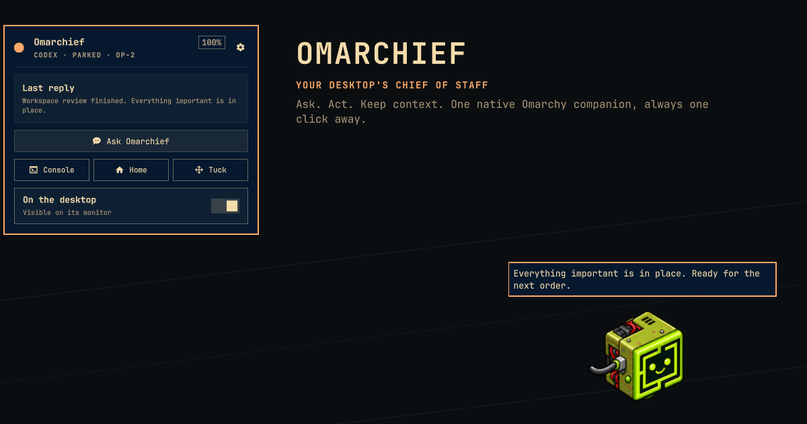
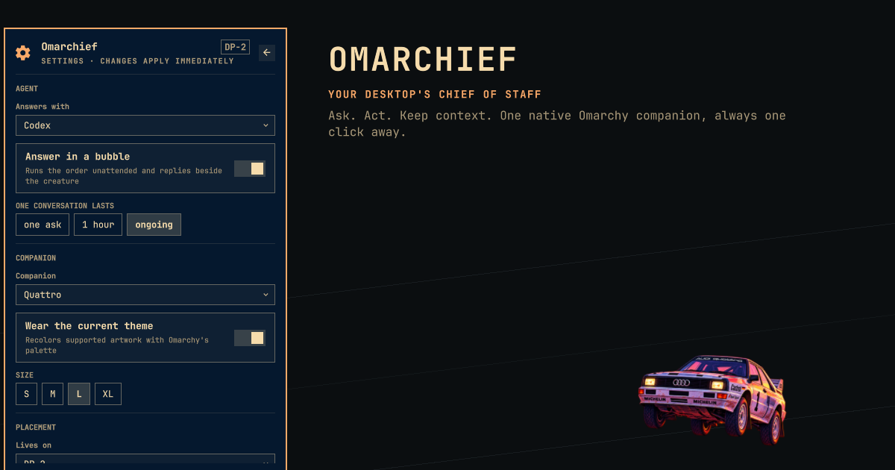

# Omarchief

Your desktop's chief of staff — a small, theme-aware companion that can act
on an order, carry an agent conversation, and stay one click away in the
Omarchy bar.



Omarchief is built around Omarchy 4's native plugin architecture: one
resident service owns the creature and its state, while every bar gets a thin
view onto that same service. There is one agent turn, one conversation, and
one place in the world no matter how many monitors you use.

## Install

```bash
omarchy plugin add https://github.com/daventhedude/omarchief.git --enable
```

That is the entire setup. Review Omarchy's unsandboxed-plugin warning, confirm
the install, and keep the declared **right** placement or choose another bar
section. Omarchy then starts the service and adds the one canonical widget
entry. Do not add a second entry to `shell.json`.

On upgrade from a pre-4.0 release, Omarchief merges the old settings once and
removes duplicate top-level/widget entries automatically. The bar entry is
the canonical settings location after migration.

## Requirements

- **Runtime:** Omarchy 4, including its Quickshell/Hyprland integration,
  `bash`, `python3`, `jq`, and the regular `omarchy-*` helpers. Omarchief installs no
  system package, daemon, hook, or background unit of its own.
- **Orders:** an agent CLI already discovered and configured by Omarchy. Claude,
  Codex, and OpenCode support bubble conversations; other Omarchy agents open
  in the native console scratchpad. The companion and its non-agent controls remain usable
  when no agent is selected.
- **Theme repainting:** ImageMagick's `magick`, included by Omarchy. If it is
  unavailable, the original sheet remains visible and a live tint is used when
  the pet permits it.
- **Development only:** Node.js 22 for model tests; Qt 6 `qmllint`, `jq`, and a
  running Wayland/Omarchy session for integration checks; Python 3, NumPy, and
  ImageMagick for the artwork builders.

## What it feels like

- Click the creature to ask for something. Enter sends; Escape closes.
- Right-click the creature for Omarchy's native console scratchpad.
- Drag it along an edge to choose its home. Push it into an outer edge to
  tuck it away; pull the visible part back out when you want it.
- Open the bar widget for status, the latest answer, quick actions, and
  settings. Middle-click asks from that bar's monitor;
  right-click opens the console there.
- Start a new conversation whenever context should not carry forward.



The creature follows the desktop rather than drawing a second UI language.
Its controls use Omarchy's colors, typography, spacing, panels, focus states,
and bar conventions. It understands multi-monitor virtual coordinates,
Hyprland's outer gap, fullscreen workspaces, the chosen default agent, and
Omarchy's rate-limit records.

## Overview and settings

The popout opens on a compact overview: current agent and state, monitor,
energy, latest answer, Ask, console, and the actions that matter now.
The settings view keeps durable choices together:

- agent and conversation lifetime;
- companion and size;
- home monitor, follow-focus behavior, and fullscreen avoidance;
- idle expressions, theme recoloring, and reduced motion.

Choices are changed in place. The panel stays open, keyboard navigation is
supported, and options that do not apply to the selected pet are left out.

## Agents

Omarchief discovers the agents Omarchy knows about and follows the desktop
default unless you choose another. Claude, Codex, and OpenCode can answer in
the bubble with session-aware follow-ups. The native console is always the
escape hatch for a longer or interactive job.

An order is never retried implicitly. While an agent turn is active, a second
order is refused instead of replacing it, and **Stop** ends that exact turn.
Timeout, cancellation, and process exit are terminal states; an old cleanup
callback cannot affect a later request.

Be clear about the trust boundary: a bubble order runs the selected agent
headlessly and unattended. Depending on the agent and CLI version, its adapter
may grant automatic approval or bypass an approval or sandbox boundary. The
standing instructions tell it to avoid irreversible work unless explicitly
ordered, but instructions are not a sandbox.

The console is Omarchy's native scratchpad, including its Quake treatment when
the installed Omarchy provides it. It makes the work visible, interactive, and
steerable. It does **not** make the agent sandboxed or promise per-tool
confirmation. Omarchief follows Omarchy's launcher when it follows the desktop
default; an explicitly selected or resumed agent uses that CLI's compatible
interactive launch mode. Treat both paths as having the filesystem and network
reach of the selected CLI.

Omarchief does not install agent hooks and does not edit another application's
settings. It may passively read an existing OmaPets-compatible status record
to reflect working, waiting, success, or error on the creature's face. Without
that record, window and rate-limit state provide the fallback.

The plugin makes no network request and sends no telemetry. The agent you
choose has its own network behavior, exactly as it does in a terminal.
Private vulnerability reports follow [SECURITY.md](SECURITY.md).

## Bring your own companion

Two companions are bundled:

- `gritty` — the default, with drawn moods, a blink, and idle expressions;
- `quattro` — the rally car from Omarchy's Tokyo Night wallpaper, adapted as
  a still, theme-aware companion under Omarchy's MIT licence.

Drop a folder containing `pet.json` and its spritesheet into:

```text
~/.config/omarchief/pets/<id>/
```

OmaPets folders under `~/.config/omapets/pets/<id>/` are also discovered.
User pets take precedence over bundled pets with the same id. Unsafe ids and
relative paths containing traversal are rejected.

Omarchief supports Codex/Petdex-style animated atlases and compact expression
grids. A pet can declare a walk cycle, mood cells, blink, idle performances,
and a themeable hue range. The complete schema is in
[docs/pets.md](docs/pets.md).

## Useful commands

```bash
omarchy-shell omarchief ask
omarchy-shell omarchief order "open my calendar"
omarchy-shell omarchief stop
omarchy-shell omarchief summon
omarchy-shell omarchief fresh
omarchy-shell omarchief travel DP-2
omarchy-shell omarchief tuck on
omarchy-shell omarchief show
omarchy-shell omarchief hide
omarchy-shell omarchief status
```

Every mutation validates its value before changing state. The JSON status
snapshot lives at
`$XDG_STATE_HOME/omarchy/omarchief/status.json` (normally
`~/.local/state/omarchy/omarchief/status.json`) for read-only integrations.
It is output, not the control plane; the bar talks to the service directly.

## Remove

```bash
omarchy plugin remove io.github.daventhedude.omarchief
```

Confirm Omarchy's removal prompt. Omarchief installs no hooks, background unit,
or command outside its plugin folder. Its optional local history and
recolored-sheet cache remain in
`$XDG_STATE_HOME/omarchy/omarchief/` (normally
`~/.local/state/omarchy/omarchief/`) so an accidental reinstall does not erase
them. They can be removed separately if that history is no longer wanted.

## Develop and verify

```bash
omarchy plugin validate .
node --test tests/*.test.mjs
tools/coldstart-check
```

The cold-start test uses an isolated HOME/XDG environment and a real plugin
manifest plus shell configuration, so an installed user pet cannot mask a
missing bundled asset. Architecture, visual checks, and the release gate are
documented in [docs/development.md](docs/development.md).

## License

MIT. The bundled Gritty artwork is original work distributed under the same
terms. Quattro retains its upstream notice in
[THIRD_PARTY_NOTICES.md](THIRD_PARTY_NOTICES.md); each pet also carries a local
NOTICE. Omarchief is independent and is not endorsed by Omarchy or the owners
of marks visible in upstream artwork.
