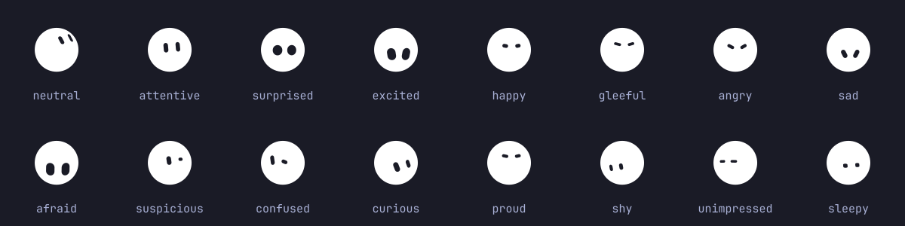

# Grok Chief

Your desktop's chief of staff — a small companion that can act on an order,
carry an agent conversation, and stay one click away in the Omarchy bar.

Its default body is **bloub**: one filled shape that morphs between states,
with two capsule eyes cut out of it. It is drawn every frame rather than
blitted from a spritesheet, so its shape, its colour and its resting
expression are settings — and changing one of them morphs on screen instead of
cutting, which no sheet of drawings can do.


Grok Chief is a fork of [Omarchief](https://github.com/daventhedude/omarchief)
with its character replaced. Everything about the desktop — the service, the
bar widget, the agent turns, the placement — is Omarchief's; what is new is a
companion that is code rather than artwork. It is built around Omarchy 4's
native plugin architecture: one resident service owns the creature and its
state, while every bar gets a thin view onto that same service. There is one
agent turn, one conversation, and one place in the world no matter how many
monitors you use.

## Install

```bash
omarchy plugin add https://github.com/moerdowo/grok-chief.git --enable
```

That is the entire setup. Review Omarchy's unsandboxed-plugin warning, confirm
the install, and keep the declared **right** placement or choose another bar
section. Omarchy then starts the service and adds the one canonical widget
entry. Do not add a second entry to `shell.json`.

Grok Chief has its own plugin id, so it installs and runs beside Omarchief
rather than replacing it. It reads none of Omarchief's settings and writes
none of its state.

## Requirements

- **Runtime:** Omarchy 4, including its Quickshell/Hyprland integration,
  `bash`, `python3`, `jq`, and the regular `omarchy-*` helpers. Grok Chief installs no
  system package, daemon, hook, or background unit of its own.
- **Orders:** an agent CLI already discovered and configured by Omarchy. Claude,
  Codex, and OpenCode support bubble conversations; other Omarchy agents open
  in the native console scratchpad. The companion and its non-agent controls remain usable
  when no agent is selected.
- **Theme repainting:** ImageMagick's `magick`, included by Omarchy. This is
  for the bundled *spritesheet* companions; the drawn one needs nothing, and
  wears the theme by picking the `Theme accent` colour.
- **Development only:** Node.js 22 for model tests; Qt 6 `qmllint`, `jq`, and a
  running Wayland/Omarchy session for integration checks; Python 3, NumPy, and
  ImageMagick for the artwork builders; `rsvg-convert` to redraw the images in
  this README.

## What it feels like

- Click the creature to ask for something. Enter sends; Escape closes.
- Right-click the creature for Omarchy's native console scratchpad.
- On a fresh install it sits at the bottom-right of the active screen; on a
  one-screen laptop that is simply the built-in display.
- Drag it along an edge to choose its home. Push it into an outer edge to
  tuck it away; pull the visible part back out when you want it.
- Open the bar widget for status, the latest answer, quick actions, and
  settings. Middle-click asks from that bar's monitor;
  right-click opens the console there.
- Start a new conversation whenever context should not carry forward.
- The drawn companion watches your pointer while it is over it, and looks up
  wearing another expression now and then while nothing is happening.

The creature follows the desktop rather than drawing a second UI language.
Its controls use Omarchy's colors, typography, spacing, panels, focus states,
and bar conventions. It understands multi-monitor virtual coordinates,
Hyprland's outer gap, fullscreen workspaces, the chosen default agent, and
Omarchy's rate-limit records.

## Overview and settings

The popout opens on a compact overview: current agent and state, monitor,
energy, latest answer, console, and only the actions that matter now.
The settings view keeps durable choices together:

- agent and conversation lifetime;
- companion and size;
- home monitor, follow-focus behavior, and fullscreen avoidance;
- idle expressions, theme recoloring, and reduced motion.

Choices are changed in place. The panel stays open, keyboard navigation is
supported, and options that do not apply to the selected pet are left out.

## Agents

Grok Chief discovers the agents Omarchy knows about and follows the desktop
default unless you choose another. Claude, Codex, and OpenCode can answer in
the bubble with session-aware follow-ups. The native console is always the
escape hatch for a longer or interactive job.

An order is never retried implicitly. While an agent turn is active, a second
order is refused instead of replacing it, and **Stop** ends that exact turn.
Timeout, cancellation, and process exit are terminal states; an old cleanup
callback cannot affect a later request.

Be clear about the trust boundary: a bubble order runs the selected agent
headlessly and unattended. Depending on the agent and CLI version, its adapter
may grant automatic approval or bypass an approval or sandbox boundary. The
standing instructions tell it to avoid irreversible work unless explicitly
ordered, but instructions are not a sandbox.

The console is Omarchy's native scratchpad, including its Quake treatment when
the installed Omarchy provides it. It makes the work visible, interactive, and
steerable. It does **not** make the agent sandboxed or promise per-tool
confirmation. Grok Chief follows Omarchy's launcher when it follows the desktop
default; an explicitly selected or resumed agent uses that CLI's compatible
interactive launch mode. Treat both paths as having the filesystem and network
reach of the selected CLI.

Grok Chief does not install agent hooks and does not edit another application's
settings. It may passively read an existing OmaPets-compatible status record
to reflect working, waiting, success, or error on the creature's face. Without
that record, window and rate-limit state provide the fallback.

The plugin makes no network request and sends no telemetry. The agent you
choose has its own network behavior, exactly as it does in a terminal.
Private vulnerability reports follow [SECURITY.md](SECURITY.md).

## Dressing the companion

The **Companion** section of the bar popout has three more choices when the
drawn companion is worn. Each one morphs rather than cuts: every shape is
sampled at the same 64 angles, so going from one to another is an
interpolation of radii, and an expression slides between two poses the same
way.

**Shape** — eight outlines: circle, pebble, squircle, capsule, triangle,
hexagon, cloud, droplet. The circle is the default and is a true circle; the
character was measured on one.

**Colour** — the original palette of twelve, plus a plain white, which is the
default and what a dark Omarchy theme wants, and **Theme accent**, which wears
whatever accent the desktop currently has. The eyes are holes rather than
white shapes, so what shows through them is the theme's background — which is
why a white body reads correctly and is clipped correctly at the outline.

**Resting expression** — sixteen faces, worn whenever nothing is happening.
The whole face is two capsules, so an expression is four levers: where the
head is pointed, how far apart the eyes sit, their proportions, and each eye's
own lean. That last one is what makes anger and sadness possible at all — they
need the eye tops to converge or diverge, which a tilt of the head cannot do.



An expression only ever shows on the faces that rest. A mood with news of its
own overrides it — working thinks, waiting notifies, an error is an
exclamation mark, finishing bursts, and being carried widens the eyes — and
those poses are measured off the reference video rather than chosen, which is
precisely what is being reproduced.

From a terminal:

```bash
omarchy-shell grokchief shape triangle
omarchy-shell grokchief color theme
omarchy-shell grokchief expression curieux
```

Each lists what it accepts when given something it does not know. A value is
required: Omarchy's IPC has no way to call one of these with nothing, the same
as `pet`.

## Bring your own companion

Four companions are bundled:

- `bloub` — the default, drawn rather than blitted, described above;
- `gritty` — a weathered little machine cube, with drawn moods, a blink, and
  idle expressions;
- `quattro` — the rally car from Omarchy's Tokyo Night wallpaper, adapted as
  a still, theme-aware companion under Omarchy's MIT licence;
- `gritty-front` — the same weathered machine facing straight ahead, kept as
  a deliberately stark still companion.

Drop a folder containing `pet.json` and its spritesheet into:

```text
~/.config/grokchief/pets/<id>/
```

OmaPets folders under `~/.config/omapets/pets/<id>/` are also discovered.
User pets take precedence over bundled pets with the same id. Unsafe ids and
relative paths containing traversal are rejected.

Grok Chief supports Codex/Petdex-style animated atlases and compact expression
grids. A pet can declare a walk cycle, mood cells, blink, idle performances,
and a themeable hue range. The complete schema is in
[docs/pets.md](docs/pets.md).

## Useful commands

```bash
omarchy-shell grokchief ask
omarchy-shell grokchief order "open my calendar"
omarchy-shell grokchief stop
omarchy-shell grokchief summon
omarchy-shell grokchief fresh
omarchy-shell grokchief travel DP-2
omarchy-shell grokchief tuck on
omarchy-shell grokchief show
omarchy-shell grokchief hide
omarchy-shell grokchief status
omarchy-shell grokchief shape goutte
omarchy-shell grokchief color bleu
omarchy-shell grokchief expression heureux
```

Every mutation validates its value before changing state. The JSON status
snapshot lives at
`$XDG_STATE_HOME/omarchy/grokchief/status.json` (normally
`~/.local/state/omarchy/grokchief/status.json`) for read-only integrations.
It is output, not the control plane; the bar talks to the service directly.

## Remove

```bash
omarchy plugin remove io.github.moerdowo.grokchief
```

Confirm Omarchy's removal prompt. Grok Chief installs no hooks, background unit,
or command outside its plugin folder. Its optional local history and
recolored-sheet cache remain in
`$XDG_STATE_HOME/omarchy/grokchief/` (normally
`~/.local/state/omarchy/grokchief/`) so an accidental reinstall does not erase
them. They can be removed separately if that history is no longer wanted.

## Develop and verify

```bash
omarchy plugin validate .
node --test tests/*.test.mjs
tools/coldstart-check
tools/verify-bloub-port
```

The cold-start test uses an isolated HOME/XDG environment and a real plugin
manifest plus shell configuration, so an installed user pet cannot mask a
missing bundled asset.

`tools/verify-bloub-port` is the check behind this README's claim that the
drawn companion's geometry is unaltered from the project it came from. It
fetches that project, samples both engines over every state, shape, expression
and a set of awkward dates, re-encodes this one's output into the exact strings
the original produces, and compares them character for character — about
seventy thousand assertions. It needs the network, so it is a release check
rather than part of `node --test`.

Two more generators, neither run at install time:

```bash
tools/build-eyefit     # regenerates keystone/BloubFit.js from the upstream solver
tools/build-preview    # redraws preview.png and docs/expressions.png
```

Architecture, visual checks, and the release gate are documented in
[docs/development.md](docs/development.md).

## License

MIT. Grok Chief is a fork of Omarchief, Copyright (c) 2026 Daven Niemann, and
its bundled Gritty artwork is that project's original work under the same
terms. The drawn companion is a port of
[bloub](https://github.com/jeremy-prt/bloub), Copyright (c) 2026 Jérémy
Perret, also MIT. Quattro retains its upstream notice in
[THIRD_PARTY_NOTICES.md](THIRD_PARTY_NOTICES.md); each pet also carries a
local NOTICE.

Grok Chief is independent. It is not endorsed by Omarchy, by the authors of
the projects it is built from, or by x.ai, whose bot avatar is the shape bloub
set out to reproduce and the only thing of theirs that appears here.
